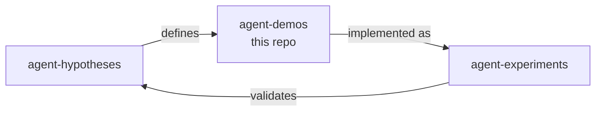

  

<h1 align="center">PennyLane Demonstrations — Agent Experiments Fork</h1>

  
  
  
  
  
  

  <b>Agent-driven experiments fork</b> of the PennyLane demonstration suite.
  Contains Python implementations of 5 testable hypotheses in hybrid quantum-classical ML.

---

## Overview

This repository is a **fork** of [PennyLaneAI/demos](https://github.com/PennyLaneAI/demos) — the official collection of demonstrations built with [PennyLane](https://pennylane.ai/), a cross-platform Python library for quantum computing, quantum machine learning, and quantum chemistry.

In addition to the full upstream demo suite, this fork adds:

### Added: Agent Experiments (`experiments/`)

| File | Hypothesis | Description |
|------|-----------|-------------|
| `h1_joint_nas_hqnn.py` | H1 | Joint Classical–Quantum NAS for Pareto-Optimal HQNN Architectures |
| `h2_engineered_dissipation_bp.py` | H2 | Engineered Dissipation vs. Local Cost for Barren Plateau Mitigation |
| `h3_post_variational_benchmarks.py` | H3 | Post-Variational Strategies on Non-Convex Landscapes |
| `h4_pde_constrained_loss.py` | H4 | PDE-Constrained Loss Functions Suppress Gradient Vanishing |
| `h5_data_reuploading_scaling.py` | H5 | Data-Reuploading with Trainable Scaling on Small Benchmarks |

Each script is a self-contained Python implementation referencing a baseline PennyLane demo. See the [pennylane-agent-hypotheses](https://github.com/NullLabTests/pennylane-agent-hypotheses) repo for full hypothesis definitions and references.

---

## Project Ecosystem

| Repository | Role |
|-----------|------|
| [pennylane-agent-hypotheses](https://github.com/NullLabTests/pennylane-agent-hypotheses) | Research hypotheses, evaluation metrics, references |
| **pennylane-demos** (this repo) | Python implementations, forked from PennyLaneAI/demos |
| [pennylane-agent-experiments](https://github.com/NullLabTests/pennylane-agent-experiments) | Runnable Jupyter notebooks, configs, CI smoke tests |

---

## Upstream Content

This fork inherits the full [PennyLane demonstration suite](https://pennylane.ai/qml/demonstrations) — a collection of tutorials and implementations ranging from introductory concepts to cutting-edge quantum computing research.

Explore the full collection at [pennylane.ai/qml/demonstrations](https://pennylane.ai/qml/demonstrations), each available for download as a Jupyter notebook or Python script.

### Quick Links

- [Contributing to Demos](CONTRIBUTING.md)
- [CLI Tool](/documentation/demo-cli.md)
- [Dependency Management](/dependencies/README.md)

---

## Support

- **Upstream Source Code:** https://github.com/PennyLaneAI/demos
- **Upstream Issue Tracker:** https://github.com/PennyLaneAI/demos/issues

If you encounter any issues, have questions, or wish to suggest improvements, please report them on the upstream GitHub issue tracker.

We are dedicated to fostering a friendly, safe, and welcoming environment for all contributors. Please review and adhere to our [Code of Conduct](/.github/CODE_OF_CONDUCT.md).

---

## License

The materials and demonstrations contained within this repository are **free** and **open-source**, released under the Apache License, Version 2.0.

Please note, the file `custom_directives.py` is available under the BSD 3-Clause License, with copyright © 2017, PyTorch contributors.
