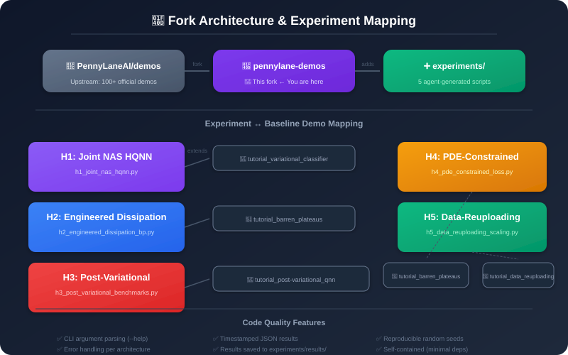
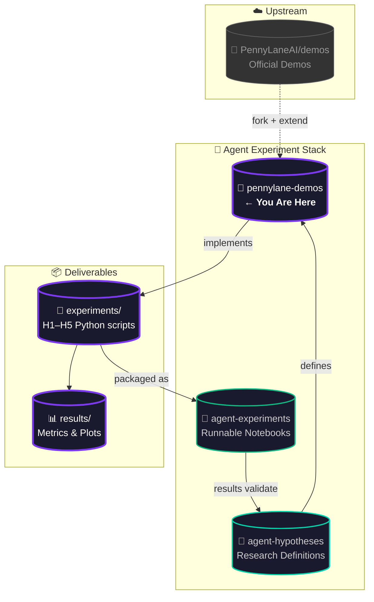
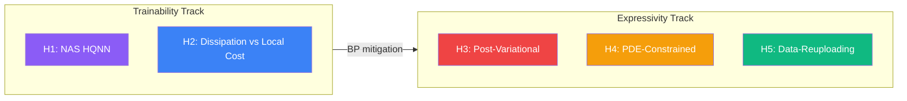
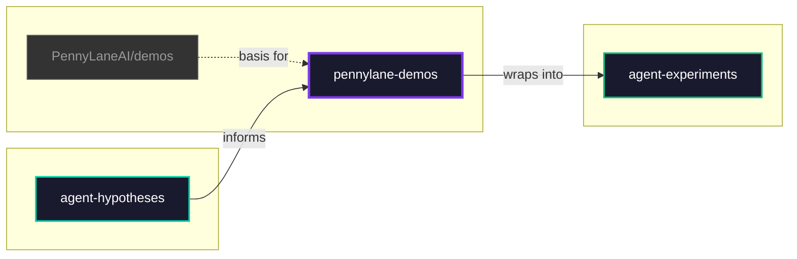
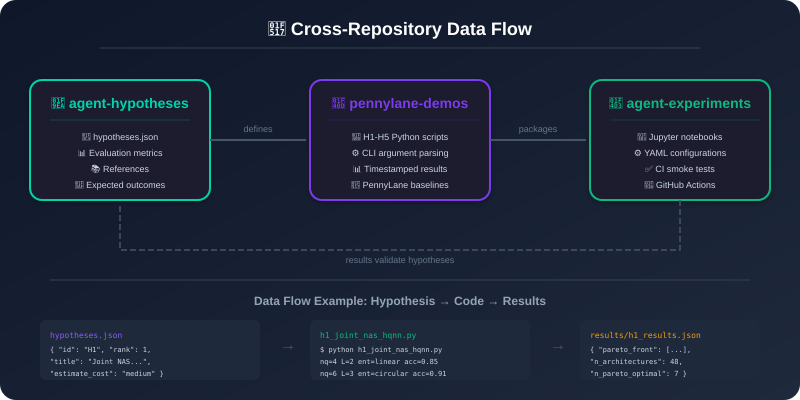

<p align="center">
  <a href="https://pennylane.ai/qml/demonstrations/" title="View PennyLane Demonstrations Online">
    
  </a>
</p>

<h1 align="center">🔬 PennyLane Demonstrations — Agent Experiments Fork</h1>

<p align="center">
  <a href="https://github.com/PennyLaneAI/demos" title="Upstream Repository">
    
  </a>
  <a href="LICENSE">
    
  </a>
  <a href="https://www.python.org/">
    
  </a>
  <a href="https://pennylane.ai">
    
  </a>
  <a href="https://github.com/NullLabTests/pennylane-agent-hypotheses">
    
  </a>
  <a href="https://github.com/NullLabTests/pennylane-agent-experiments">
    
  </a>
  <a href="https://github.com/NullLabTests/pennylane-demos/pulse">
    
  </a>
  <a href="https://github.com/NullLabTests/pennylane-demos/blob/master/CONTRIBUTING.md">
    
  </a>
</p>

<p align="center">
  <b>Agent-driven experiments fork</b> of the PennyLane demonstration suite.<br/>
  Contains <b>5 Python implementations</b> of testable hypotheses in hybrid quantum-classical ML.<br/>
  <sub>⬆️ Inherits the full upstream demo collection from <a href="https://github.com/PennyLaneAI/demos">PennyLaneAI/demos</a>.</sub>
</p>

<br/>

<p align="center">
  
</p>
<p align="center"><sub>Fork architecture showing upstream origin, added experiments, and mapping of each hypothesis to its PennyLane baseline demo. Each experiment extends a specific tutorial.</sub></p>

<br/>

---

## 🌐 Ecosystem Overview



<br/>

---

## 🧪 What's New: Agent Experiments (`experiments/`)

This fork adds **5 agent-generated experiment scripts** on top of the full PennyLane demo suite.

### Experiment Matrix



| ID | Script | Area | Est. Cost | Dependencies | Run Command |
|:--:|--------|:----:|:---------:|:-----------|:------------|
| **H1** | [`h1_joint_nas_hqnn.py`](experiments/h1_joint_nas_hqnn.py) |  |  | `pennylane torch scikit-learn` | `python experiments/h1_joint_nas_hqnn.py` |
| **H2** | [`h2_engineered_dissipation_bp.py`](experiments/h2_engineered_dissipation_bp.py) |  |  | `pennylane matplotlib` | `python experiments/h2_engineered_dissipation_bp.py` |
| **H3** | [`h3_post_variational_benchmarks.py`](experiments/h3_post_variational_benchmarks.py) |  |  | `pennylane scikit-learn` | `python experiments/h3_post_variational_benchmarks.py` |
| **H4** | [`h4_pde_constrained_loss.py`](experiments/h4_pde_constrained_loss.py) |  |  | `pennylane matplotlib` | `python experiments/h4_pde_constrained_loss.py` |
| **H5** | [`h5_data_reuploading_scaling.py`](experiments/h5_data_reuploading_scaling.py) |  |  | `pennylane scikit-learn` | `python experiments/h5_data_reuploading_scaling.py` |

Each script is **self-contained** with CLI argument parsing (`--help` for options) and timestamped JSON output saved to `experiments/results/`.

<br/>

---

## 🚀 Getting Started

### Prerequisites

```bash
# Python 3.10+
python --version

# PennyLane (core + lightning simulator)
pip install pennylane pennylane-lightning
```

### Run All Experiments

```bash
# Clone this fork
git clone https://github.com/NullLabTests/pennylane-demos.git
cd pennylane-demos

# Run experiments sequentially
for script in experiments/h*.py; do
    echo "=== Running $script ==="
    python "$script"
    echo ""
done
```

### Run with Custom Parameters

Each script supports CLI arguments:

```bash
python experiments/h1_joint_nas_hqnn.py --n-samples 200 --n-epochs 20 --output-dir experiments/results
python experiments/h2_engineered_dissipation_bp.py           # uses defaults
python experiments/h3_post_variational_benchmarks.py        # uses defaults
python experiments/h4_pde_constrained_loss.py               # uses defaults
python experiments/h5_data_reuploading_scaling.py           # uses defaults
```

Results are saved to `experiments/results/<id>_<timestamp>.json` with plots in PNG format.

<br/>

---

## 📁 Repository Structure

```
📦 pennylane-demos (fork)
│
├── 🧪 AGENT EXPERIMENTS — Added content
│   ├── 📁 experiments/
│   │   ├── h1_joint_nas_hqnn.py              # H1: NAS for Pareto-optimal HQNNs
│   │   ├── h2_engineered_dissipation_bp.py    # H2: Engineered dissipation vs local cost
│   │   ├── h3_post_variational_benchmarks.py  # H3: Post-variational strategies
│   │   ├── h4_pde_constrained_loss.py         # H4: PDE-constrained loss functions
│   │   ├── h5_data_reuploading_scaling.py     # H5: Trainable data reuploading
│   │   └── 📁 results/                        # 📊 Generated metrics & plots (gitignored)
│   └── 📄 README.md                           # ℹ️ This file
│
├── ⬆️ UPSTREAM CONTENT — Inherited from PennyLaneAI/demos
│   ├── 📁 demonstrations_v2/                  # 🌐 Official PennyLane demo notebooks
│   ├── 📁 dependencies/                       # 📦 Dependency metadata
│   ├── 📁 documentation/                      # 📖 CLI tool & docs
│   ├── 📁 lib/                                # 🛠️ Shared utilities
│   ├── 📁 _static/                            # 🎨 Web assets
│   ├── 📁 _templates/                         # 📝 Sphinx templates
│   ├── 📄 conf.py                             # ⚙️ Sphinx configuration
│   ├── 📄 index.rst                           # 📑 Documentation index
│   ├── 📄 CONTRIBUTING.md                     # 📖 Contributor guide
│   └── 📄 LICENSE                             # ⚖️ Apache 2.0
│
└── 🛠️ BUILD & CI
    ├── 📄 pyproject.toml                      # 🐍 Poetry project config
    ├── 📄 poetry.lock                         # 🔒 Locked dependencies
    ├── 📄 extension.py                        # 🔧 Sphinx extension
    └── 📁 .github/                            # 🤖 CI workflows
```

<br/>

---

## 🔗 Sister Repositories

| Repository | Badge | Purpose | Link |
|-----------|-------|---------|------|
| **agent-hypotheses** |  | Research hypotheses & metrics | [→ View](https://github.com/NullLabTests/pennylane-agent-hypotheses) |
| **pennylane-demos** (this repo) |  | Python scripts (forked) | ← You are here |
| **agent-experiments** |  | Notebooks + CI | [→ View](https://github.com/NullLabTests/pennylane-agent-experiments) |

### Data Flow



<br/>

<p align="center">
  
</p>
<p align="center"><sub>End-to-end data flow: hypotheses.json defines experiment parameters → Python scripts execute with CLI args → timestamped JSON results validate hypotheses. A complete feedback loop across all three repositories.</sub></p>

<br/>

---

## ⬆️ Upstream Attribution

This fork inherits the full [PennyLane demonstration suite](https://pennylane.ai/qml/demonstrations) — a collection of tutorials and implementations ranging from introductory concepts to cutting-edge quantum computing research. Built by [Xanadu](https://xanadu.ai/), for research.

| Resource | Link |
|----------|------|
| 🌐 Online Demonstrations | [pennylane.ai/qml/demonstrations](https://pennylane.ai/qml/demonstrations) |
| 📖 Contributing Guide | [`CONTRIBUTING.md`](CONTRIBUTING.md) |
| 🛠️ CLI Tool | [`documentation/demo-cli.md`](/documentation/demo-cli.md) |
| 📦 Dependency Management | [`dependencies/README.md`](/dependencies/README.md) |
| 🐛 Issue Tracker | [PennyLaneAI/demos/issues](https://github.com/PennyLaneAI/demos/issues) |

<br/>

---

## 📄 License

The materials and demonstrations contained within this repository are **free** and **open-source**, released under the **Apache License, Version 2.0**.

Please note, the file `custom_directives.py` is available under the **BSD 3-Clause License**, with copyright © 2017, PyTorch contributors.

---

<p align="center">
  <sub>Part of the <a href="https://github.com/NullLabTests">NullLabTests</a> agent-driven research ecosystem.</sub>
  <br/>
  <sub>
    
    
    
  </sub>
</p>
