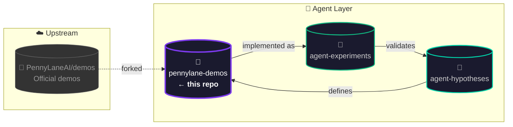

<p align="center">
  <a href="https://pennylane.ai/qml/demonstrations/" title="View PennyLane Demonstrations Online">
    
  </a>
</p>

<h1 align="center">🔬 PennyLane Demonstrations — Agent Experiments Fork</h1>

<p align="center">
  <a href="https://github.com/PennyLaneAI/demos" title="Upstream Repository">
    
  </a>
  <a href="LICENSE">
    
  </a>
  <a href="https://www.python.org/">
    
  </a>
  <a href="https://pennylane.ai">
    
  </a>
  <a href="https://github.com/NullLabTests/pennylane-agent-hypotheses">
    
  </a>
  <a href="https://github.com/NullLabTests/pennylane-agent-experiments">
    
  </a>
  <a href="https://github.com/NullLabTests/pennylane-demos/graphs/contributors">
    
  </a>
</p>

<p align="center">
  <b>Agent-driven experiments fork</b> of the PennyLane demonstration suite.<br/>
  Contains <b>5 Python implementations</b> of testable hypotheses in hybrid quantum-classical ML.
</p>

<br/>

---

## 🌐 Overview

This repository is a **fork** of [PennyLaneAI/demos](https://github.com/PennyLaneAI/demos) — the official collection of demonstrations built with [PennyLane](https://pennylane.ai/), a cross-platform Python library for quantum computing, quantum machine learning, and quantum chemistry.

In addition to the full upstream demo suite, this fork adds:

<br/>

### ➕ Added: Agent Experiments (`experiments/`)

<p align="center">

| File | Hypothesis | Area | Est. Cost |
|------|-----------|:----:|:---------:|
| [`h1_joint_nas_hqnn.py`](experiments/h1_joint_nas_hqnn.py) | **H1** — Joint Classical–Quantum NAS for Pareto-Optimal HQNNs |  |  |
| [`h2_engineered_dissipation_bp.py`](experiments/h2_engineered_dissipation_bp.py) | **H2** — Engineered Dissipation vs. Local Cost for BP Mitigation |  |  |
| [`h3_post_variational_benchmarks.py`](experiments/h3_post_variational_benchmarks.py) | **H3** — Post-Variational Strategies on Non-Convex Landscapes |  |  |
| [`h4_pde_constrained_loss.py`](experiments/h4_pde_constrained_loss.py) | **H4** — PDE-Constrained Loss Functions Suppress Gradient Vanishing |  |  |
| [`h5_data_reuploading_scaling.py`](experiments/h5_data_reuploading_scaling.py) | **H5** — Data-Reuploading with Trainable Scaling on Small Benchmarks |  |  |

</p>

Each script is a self-contained Python implementation with CLI argument parsing and timestamped result output. See the <a href="https://github.com/NullLabTests/pennylane-agent-hypotheses"></a> repo for full hypothesis definitions and references.

<br/>

---

## 🔗 Project Ecosystem



| Repository | Badge | Role |
|-----------|-------|------|
| [pennylane-agent-hypotheses](https://github.com/NullLabTests/pennylane-agent-hypotheses) |  | Research hypotheses, evaluation metrics, references |
| **pennylane-demos** (this repo) |  | Python implementations, forked from PennyLaneAI/demos |
| [pennylane-agent-experiments](https://github.com/NullLabTests/pennylane-agent-experiments) |  | Runnable Jupyter notebooks, configs, CI smoke tests |

<br/>

---

## 🧪 Quick Start: Run an Experiment

```bash
# Clone this fork
git clone https://github.com/NullLabTests/pennylane-demos.git
cd pennylane-demos

# Run an experiment (e.g., H1 — NAS for Pareto-Optimal HQNNs)
pip install pennylane pennylane-lightning torch scikit-learn
python experiments/h1_joint_nas_hqnn.py --n-samples 200 --n-epochs 20
```

Results are saved to `experiments/results/` with timestamps.

<br/>

---

## 📁 Repository Structure

```
📦 pennylane-demos (fork)
├── 📁 experiments/            # 🧪 Agent experiment scripts (H1–H5)
│   ├── h1_joint_nas_hqnn.py
│   ├── h2_engineered_dissipation_bp.py
│   ├── h3_post_variational_benchmarks.py
│   ├── h4_pde_constrained_loss.py
│   ├── h5_data_reuploading_scaling.py
│   └── 📁 results/            # 📊 Generated results (gitignored)
├── 📁 demonstrations_v2/      # ⬆️ Upstream PennyLane demos
├── 📄 README.md
├── 📄 CONTRIBUTING.md
├── 📄 LICENSE                 # Apache 2.0
└── ...
```

<br/>

---

## ⬆️ Upstream Content

This fork inherits the full [PennyLane demonstration suite](https://pennylane.ai/qml/demonstrations) — a collection of tutorials and implementations ranging from introductory concepts to cutting-edge quantum computing research.

Explore the full collection at [pennylane.ai/qml/demonstrations](https://pennylane.ai/qml/demonstrations), each available for download as a Jupyter notebook or Python script.

| Resource | Link |
|----------|------|
| 📖 Contributing Guide | [`CONTRIBUTING.md`](CONTRIBUTING.md) |
| 🛠️ CLI Tool | [`documentation/demo-cli.md`](/documentation/demo-cli.md) |
| 📦 Dependency Management | [`dependencies/README.md`](/dependencies/README.md) |

<br/>

---

## 🆘 Support

| Channel | Link |
|---------|------|
| 📝 Upstream Source Code | [PennyLaneAI/demos](https://github.com/PennyLaneAI/demos) |
| 🐛 Upstream Issue Tracker | [PennyLaneAI/demos/issues](https://github.com/PennyLaneAI/demos/issues) |

We are dedicated to fostering a friendly, safe, and welcoming environment for all contributors. Please review and adhere to our [Code of Conduct](/.github/CODE_OF_CONDUCT.md).

<br/>

---

## 📄 License

The materials and demonstrations contained within this repository are **free** and **open-source**, released under the **Apache License, Version 2.0**.

Please note, the file `custom_directives.py` is available under the **BSD 3-Clause License**, with copyright © 2017, PyTorch contributors.
